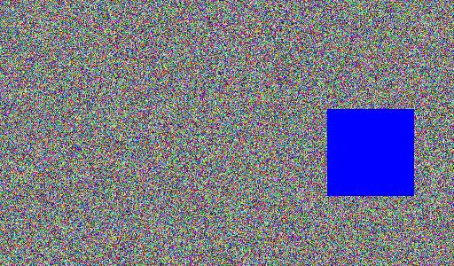
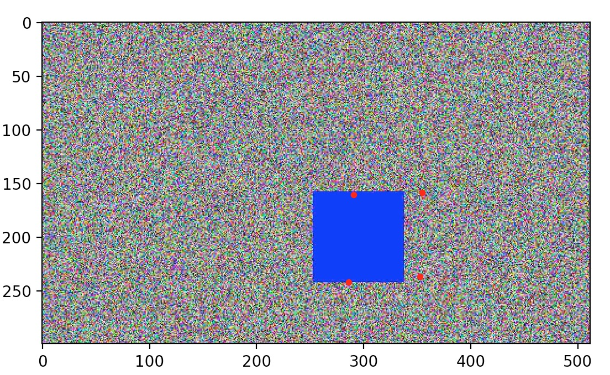

# Teaching a Pytorch Neural Network to find a square

With these pytorch scripts I create training data of a blue square of varying
sizes planted in a 'noise' image, and train a raw neural network to try to learn
to find the square by outputting the coordinates of the square vertices.

## Description

With the script create_rand_images.py I create training and test images like the
one below, accompanied by a csv file that describes the coordinates of the test
square in the image.

Below is a random sample created byt the script:
<p align="center">
    
 </p>

and train a neural network to try to predict the square coordinates in an image.

## Sample usage

To create training and validation sets:
```
python create_rand_images.py -p train_1k -o train_1k -m 1000
```
and
```
python create_rand_images.py -p validate -o validate -m 1000
```

Time to train:
```
python learn_square.py -t train/ -o ./square_detector.pth -n 8 -s 100
```

Once it's done training, it's time to test!
```
python test_square.py -v validate -m ./square_detector.pth -n 1000 -s 100
```

You can take a look at some of the results by running:
```
python show_square_predictions.py -i validate -m ./square_detector.pth -n 5
```

Depending on how much training you put on it, you will get better results than the
one I pasted below, showing an output after 4 epochs of training on a 1K generated dataset.
It achieved a running loss of about 20.
<p align="center">
    
 </p>
 
That's it. Time to play.

<p align="center">
    
 </p>
